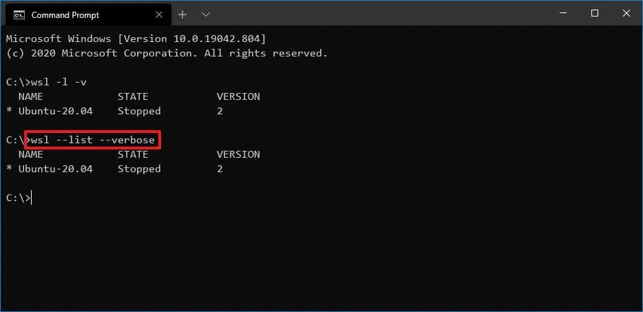
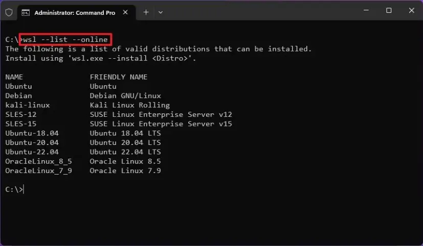
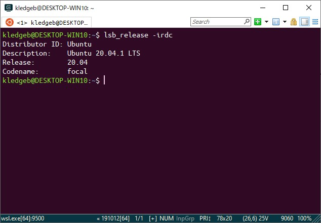
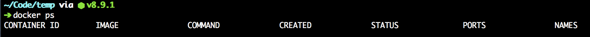

[[_TOC_]]

# Usare WSL Ubuntu come docker host per il remote container

Docker desktop è comodo, ma molto inefficente a livello di prestaizoni e peso su SO, meglio rimuoverlo, se si vuole usare la feature Devcontainer di VS Code per lo sviluppo portabile e self contained di applicazioni.

## Rimuovere Docker Desktop

Usando i normali strumenti di rimozione delle applicazioni in windows (tipicamente `Installazione Applicazioni`, cercare e rimuovere Docker Desktop.

## Controllare di avere WSL alla versione 2

Aprire powershell e lanciare questo comando:

```powershell
wsl -l -v
```



E' importante che sotto la colonna VERSION venga visualizzato 2.

### Aggiornare WSL

Visto che l'abilitazione di systemd è presente solo nelle ultime versioni di WSL2, è meglio assicurarsi che sia installata l'ultima versione disponibile da Microsoft:

```powershell
wsl --update
```

## Installare l'ultima versione di Ubuntu LTS dal Windows Store

Per prima cosa, controlliamo le immagini presenti online, ufficialmente supportate:

```powershell
wsl --list --online
```



E poi installiamo l'ultima versione disponibile

```powershell
wsl --install -d Ubuntu-22.04
```

### Eventualmente aggiornare la Ubuntu già esistente

Se il comando precedente non funzionasse (in alcuni casi, ad esempio col Microsoft Store bloccato da policy aziendali) e se esiste una versione precedente di Ubuntu (ad esempio la 20.04) già installata in WSL2, si possono usare i normali strumenti di aggiornamento di Ubuntu.

Lanciate dal **Menu Avvio** l'App **Ubuntu**.
Una volta proiettati nella shell di Ubuntu, potete controllare la versione corrente:

```sh
lsb_release -a
```


Se è minore della `22.04`, al momento di scrivere questo documento era la versione LTS più nuova.

Aggiorniamo la versione corrente di Ubuntu all'ultima disponibile:

```sh
sudo apt update
sudo apt dist-upgrade -y
sudo apt autoremove -y
```

E ora lanciamo il comando per l'aggiornamento di versione del sistema operativo:

```sh
sudo do-release-upgrade -d
```

Verrete guidati attraverso l'aggiornamento all'ultima versione della Ubuntu, verranno poste alcune domande a cui rispondere `Y` o `N`.

#### Uscire da Ubuntu e riavviare WSL2

```sh
exit
```

```powershell
wsl --shutdown
```

## Abilitare systemd nella Ubuntu e riavviare WSL2

Lanciate dal **Menu Avvio** l'App **Ubuntu**.
Entrando nella shell della Ubuntu, aprire il file wsl.conf per abilitare systemd:

```sh
sudo nano /etc/wsl.conf
```

```ini
[boot]
systemd=true
```

### Riavviare WSL2

```powershell
wsl --shutdown
```

## Check post abilitazione

Una volta abilitato systemd, si può controllare che sia effettivamente avviato.
Lanciate dal **Menu Avvio** l'App **Ubuntu**.
Nella shell di Ubuntu digitate:

```sh
systemctl list-unit-files --type=service
```

Ora potete aprire di nuovo la Ubuntu che presenterà il systemd attivo e pronto ad accogliere l'avvio automatico del docker daemon: dal menu Avvio, selezionate la App Ubuntu, verrete proiettati dentro alla shell GNU/linux di Ubuntu.

## Rimuovere la cartella .docker

Controllare se Docker desktop ha lasciato una cartella .docker nella HOME della vostra Ubuntu, nel caso, rimuovetela:

```sh
ls -l ~/.docker
rm -rf ~/.docker
```

## Installare Docker

Lanciando questi comandi si può installare l'ultima versione di docker nella propria Ubuntu:

```sh
sudo apt update
sudo apt install \
    ca-certificates \
    curl \
    gnupg
sudo install -m 0755 -d /etc/apt/keyrings
curl -fsSL https://download.docker.com/linux/ubuntu/gpg | sudo gpg --dearmor -o /etc/apt/keyrings/docker.gpg
sudo chmod a+r /etc/apt/keyrings/docker.gpg
echo \
  "deb [arch="$(dpkg --print-architecture)" signed-by=/etc/apt/keyrings/docker.gpg] https://download.docker.com/linux/ubuntu \
  "$(. /etc/os-release && echo "$VERSION_CODENAME")" stable" | \
  sudo tee /etc/apt/sources.list.d/docker.list > /dev/null
sudo apt-get update
sudo apt-get install docker-ce docker-ce-cli containerd.io docker-buildx-plugin docker-compose-plugin
sudo groupadd docker
sudo usermod -aG docker $USER
newgrp docker
docker ps
```

Se l'ultimo comando restituisce una schermata simile a:



Complimenti! Avete installato correttamente docker.

## Clonare il repository

Usate sempre il filesystem linux e non quello montato da windows, di default, WSL2 apre la shell sh nella cartella montata come cartella di rete, che rappresenta la vostra User home in windows, ma questo aggiunge un livello di indirettezza che può portare a problemi, il consiglio è di lavorare sempre con la cartella $HOME vera e propria del vostro utente GNU/Linux, per fare questo basta chiamare il comando `cd` senza nessun parametro, questo farà sempre in modo di entrare nella vostra cartella $HOME:

```sh
cd
```

### Configurare GIT

Prima di tutto controlliamo che git sia installato:

```sh
sudo apt install git
git --version
```

Ora configurate i parametri Globali, ricordate sempre che è molto comodo, se lavorate con altri programmatori, vedere chiaramente chi ha effetuato dei commit, quindi usate sempre valori sensati in queste configurazioni, ovviamente, modificate il nome e l'email dei due comandi che seguono per riflettere i vostri:

```sh
git config --global user.name "John Doe"
git config --global user.email johndoe@example.com
git config --global core.editor code
git config --global init.defaultBranch main
```

### Generate una chiave pubblica da salvare in GitLab

```sh
ssh-keygen -o
```

Accettate tutti i default e non mettete password.
Ora visualizzate e copiate la chiave pubblica, da salvare in GitLab:

```sh
cat ~/.ssh/id_rsa.pub
```

Aprite il sito di [GitLab](https://devops.bancolini.com), eseguite il login e, cliccando sul vostro Avatar in alto a destra, selezionate Profilo -> SSH Keys e incollate nella textarea la vostra chiave pubblica, mi raccomando, togliete, prima di salvare la chiave pubblica, la data di expiration, altrimenti diventa un mondo più sicuro, ma altrettanto palloso.

**Qui finiscono le istruzioni Una Tantum. Quelle sotto le dovrete usare ogni volta che volete aggiungere un progetto su cui lavorare.**

# Lavorare tutti i giorni con VS Code e devcontainer su WSL2

## Clonate il progetto su cui volete lavorare

Ad esempio MyPrint Frontend:

Lanciate dal **Menu Avvio** l'App **Ubuntu**.

```sh
cd # Così siete sicuri di essere nella $HOME di GNU/Linux
git clone git@devops.bancolini.com:dev/spot/frontend/myprint.git
cd myprint
```

## Lanciate VS Code

Da dentro la cartella myprint, lanciate il comando code:

```sh
code .
```

Vi si aprirà VS Code il folder di myprint e dopo un po', in basso a destra, comparirà la notifica di "Reopen in Contaner", fatelo!

**Buon Lavoro**

# Ref.

- https://docs.docker.com/engine/install/ubuntu/
