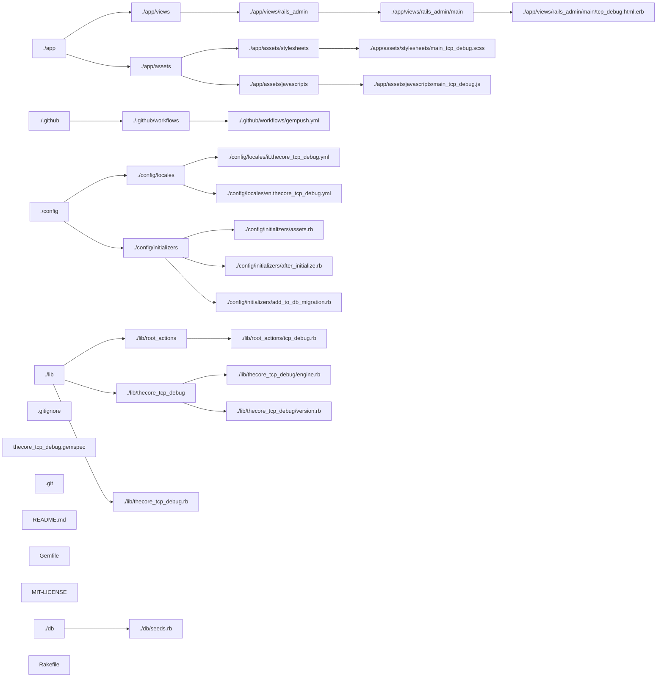

# Naming conventions

- _ATOMS_ and *gems* are interchangeable.
- `lib/[this_atom_name].rb` and similar, indicates the file, named after the current gem name, which resides in lib.
- `require '[other_atom]'` and similar, indicates the name of another gem on which the current one is dependant.

# ATOMS

# Folder Structure

Usually an _ATOM_ adds some conventions also on folders and files structure, here is the base structure you'll see more often when dealing with _ATOMS_:



## `*.gemspec` file

An _ATOM_ can depend on these two base thecore ATOMS. They can added together or just once, be the ATOM an API only gem or a gem which delivers functionalities useful for a GUI experience.

```ruby
s.add_dependency 'thecore_ui_rails_admin', '~> 3.0'
s.add_dependency 'model_driven_api', '~> 3.0'
```

The _ATOM_ can depend also on another _ATOM_, at which point `thecore_ui_rails_admin` and/or `model_driven_api` are already included in the dependency chain and only the other _ATOM_ needs to be added as a dependency.

### Autoload the dependency

It's advised to add in the `lib/[this_atom_name].rb` file all the **requires** pointing to depending _ATOMS_, for example, whenever you add a dependency in the `*.gemspec` file, please add the relevant `require '[other_atom]'` to the `lib/[this_atom_name].rb` of the current _ATOM_ you are developing.

## .gitignore

[Here](../samples/Gitignore) you can find a sample of a sane and comprehensive Git ignore file.

## Root Actions

Root Actions are [Rails Admin](https://github.com/railsadminteam/rails_admin) actions which are not directly dependant on a Model. They don't follow CRUD and add a business logic level to the application, in order to provide a more complex interaction witht he User.
The menu entry will be rentered in a special section of the menu, outside Model's ones.

They are defined by convention in the `lib/root_actions` folder of the gem and follow a specific format, like this example from the [Thecore TCP Debug]() _ATOM_.

Have a look at the comments in this snippet to bettr understand:

```ruby
RailsAdmin::Config::Actions.add_action "tcp_debug", :base, :root do
    # For the root action's menu item to appear in the right menu, these five ones are mandatory:
    show_in_sidebar true
    show_in_navigation false
    breadcrumb_parent [nil]
    member false
    collection false
    
    # Icon is the graphical element whch appears besides the menu item, must be chosen from 
    # FontAwesome available icons:
    link_icon 'fas fa-heartbeat'
    
    # The method to interact with the controller section below, can be any HTTP verb, also more than one
    http_methods [:get]

    # Adding the controller which is needed to compute calls from the ui
    controller do
        # This is needed because we need that this code is re-evaluated each time is called
        # this mins the proc do part is mandatory
        proc do
            # Not mandatory, but is always useful to distinguish between a REST or an AJAX call.
            if request.xhr?
                # I can access params passed during the call and use them inside this controller's business logic.
                case params["test"]
                when "telnet"
                    port_is_open = Socket.tcp(params["host"], params["port"], connect_timeout: 5) { true } rescue false
                    message, status = { debug_status: I18n.t("tcp_debug_telnet_ko", host: params["host"].presence || "-", port: params["port"].presence || "-") }, 503
                    message, status = { debug_status: I18n.t("tcp_debug_telnet_ok", host: params["host"].presence || "-", port: params["port"].presence || "-") }, 200 if port_is_open
                when "ping"
                    check = Net::Ping::External.new(params["host"])
                    message, status = { debug_status: I18n.t("tcp_debug_ping_ko", host: params["host"].presence || "-") }, 503
                    message, status = { debug_status: I18n.t("tcp_debug_ping_ok", host: params["host"].presence || "-") }, 200 if check.ping?
                else
                    message, status = { debug_status: I18n.t("invalid_test", host: params["host"]) }, 400
                end

                # Thecore comes preconfigured to deliver Websocket messages, why not use them to make this 
                # controller more reactive?
                ActionCable.server.broadcast("messages", { topic: :tcp_debug, status: status, message: message})

                # It follows the RESTful convention:
                render json: message.to_json, status: status
            else
                Rails.logger.debug "When the request is not an AJAX call."
            end
        end
    end
end
```

### Load the root action at runtime

In `config/initializers/after_initialize.rb` add the require to load this root action, like: `require "root_actions/tcp_debug"`.

### The View

In `app/views/rails_admin/main/tcp_debug.html.erb` add the HTML that must be rendered to create the UX.

### Styles

Add all the styles that are only needed in the current **Root Action** in a  file named after the action name defined in `RailsAdmin::Config::Actions.add_action`, in this example the right place is: `app/assets/stylesheets/main_tcp_debug.scss`.
Please note that the controller is always main in Rails Admin context and the other part is the root action name.

### Javascripts

Javascript can be added in two different ways, be it conventionally loadaded in the layout using the controller and action names or embedded in a `<script></script>` tag directly in the `*.html.erb` file.
Both need to follow some guidelines to be correctly loaded at runtime by both Turbo or a normal RESTful call of the page.

#### Based on the Action Name

Add all the jvascripts that are only needed in the current **Root Action** in a  file named after the action name defined in `RailsAdmin::Config::Actions.add_action`, in this example the right place is: `app/assets/stylesheets/main_tcp_debug.js`.
Please note that the controller is always main in Rails Admin context and the other part is the root action name.

#### Embedded in HTML.ERB files

To embed the Javascript file directly into the action's `.html.erb` file is advised to:

- Surround the code in a `<script></script>` tag.
- Put all the variables needed by the events in the root of the script tag.
- Put all the functions at the root of the script tag.
- Put all the business logic into a `document.addEventListener("turbo:load", function (event) { });` listener.

# THECORE APP

## Dependencies

In the thecore APP the preferred way to integrate your code is by putting in the Gemfile.base the ATOM which depends on the base thecore ATOMS: [Model Driven API](https://github.com/gabrieletassoni/model_driven_api) and [Thecore UI Rails Admin](https://github.com/gabrieletassoni/thecore_ui_rails_admin). These are added in a separate way to allow developer to focus on the needed aspects of the application, UI or API based.

```ruby
gem 'your_business_logic_atom', '~> 3.0'
```
